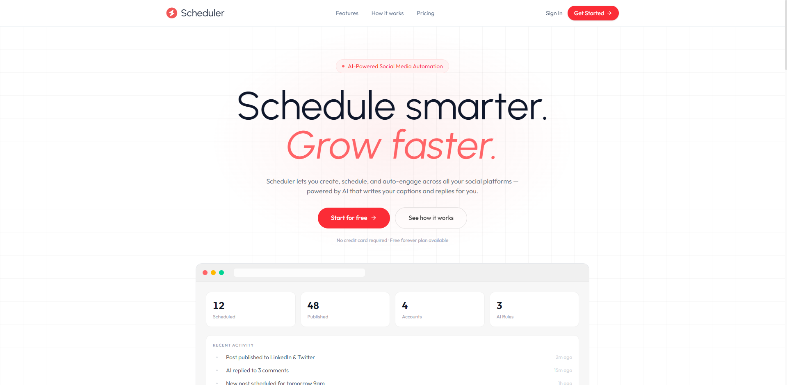
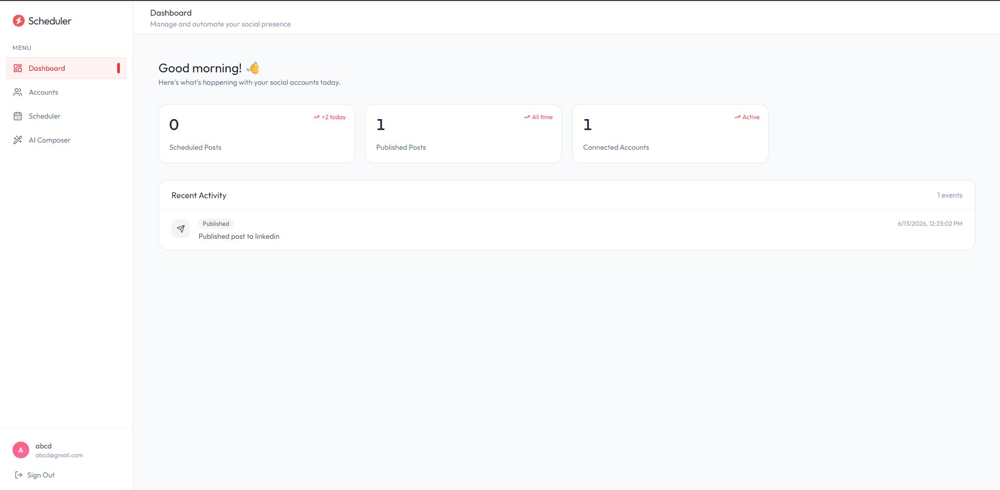
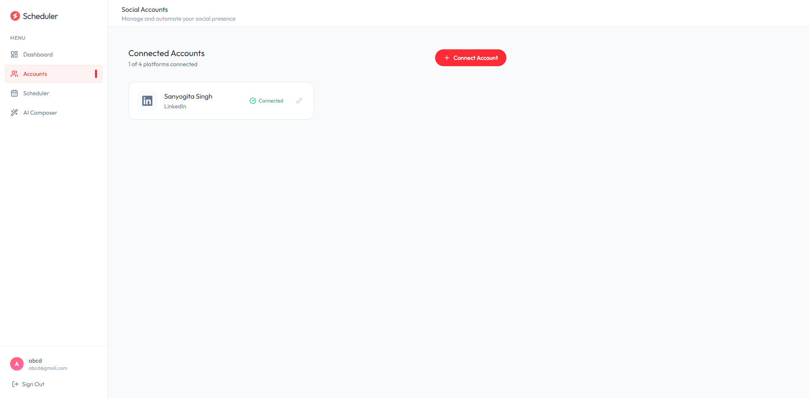
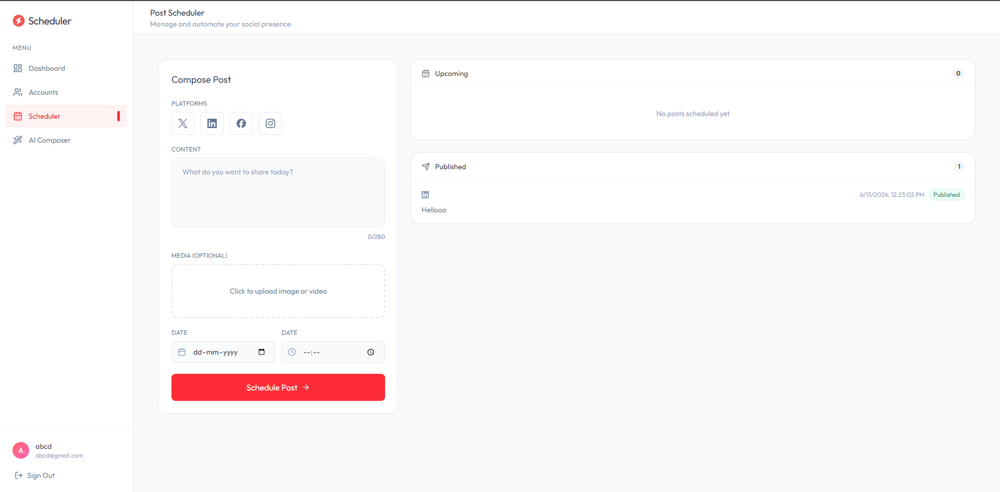
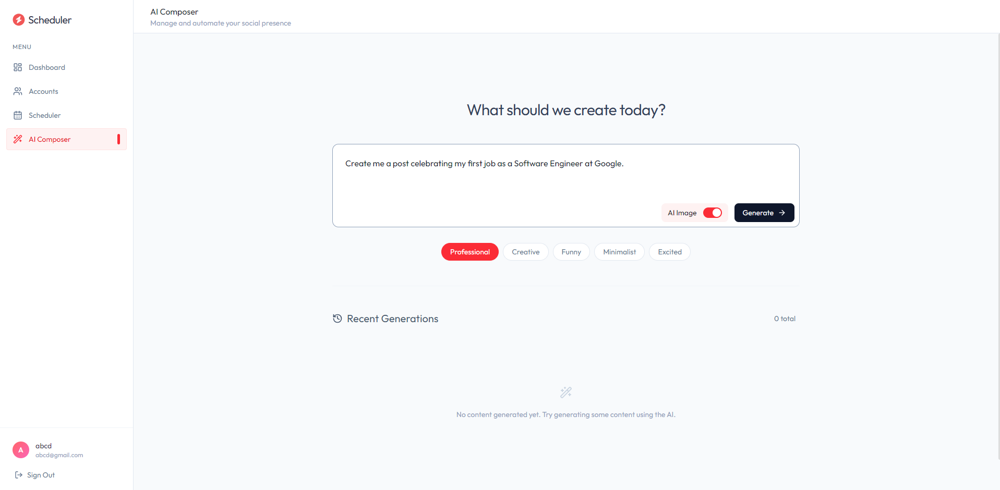
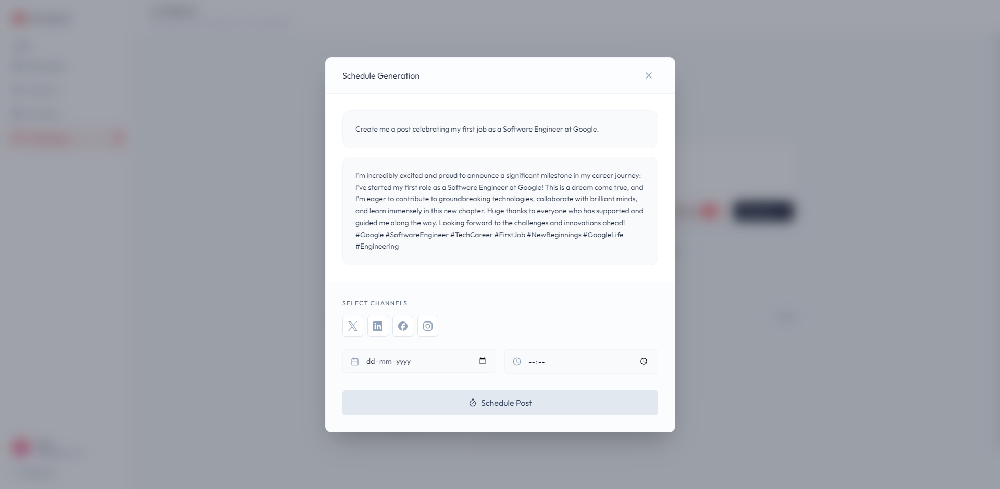

# 📅 Scheduler — AI-Powered Social Media Automation

> Schedule smarter. Grow faster.

A full-stack AI-powered social media automation platform that lets you create, schedule, and publish posts across multiple social platforms — all from a single dashboard. Generate engaging content using Google Gemini AI and Leonardo.ai, upload media via Cloudinary, and let the background scheduler handle publishing automatically.

---

## 🔴 Live Demo

🌐 [social-media-client-indol.vercel.app](https://social-media-client-indol.vercel.app)

---

## 👩‍💻 Author

**Sanyogita Singh**
- GitHub repo: [@sanyogitasinghbgm-spec](https://github.com/sanyogitasinghbgm-spec/ai-social-media-scheduler.git)

---

## ✨ Features

- 🔐 **Authentication** — Secure JWT-based sign up & sign in
- 📊 **Dashboard** — Real-time stats: scheduled posts, published posts, connected accounts, recent activity
- 🔗 **Multi-Platform Support** — Connect and manage Twitter/X, LinkedIn, Facebook, and Instagram from one place
- 🗓️ **Post Scheduler** — Compose posts with text, media upload, platform selection, and date/time scheduling
- 🤖 **AI Composer** — Generate captions and images from a prompt using Google Gemini + Leonardo.ai with tone selection (Professional, Creative, Funny, Minimalist, Excited)
- ⚙️ **Auto Publishing** — Background cron job publishes scheduled posts automatically every minute
- 🖼️ **Media Upload** — Upload images and videos with live preview, stored on Cloudinary
- 📋 **Activity Log** — Track all publishing and AI generation activity
- 📱 **Responsive UI** — Clean, mobile-friendly design with sidebar navigation

---

## 🛠️ Tech Stack

### Frontend
| Technology | Purpose |
|------------|---------|
| React 19 + TypeScript | UI framework |
| Vite | Build tool |
| Tailwind CSS v4 | Styling |
| React Router v7 | Client-side routing |
| Axios | HTTP requests |
| React Hot Toast | Notifications |
| Lucide React | Icons |

### Backend
| Technology | Purpose |
|------------|---------|
| Node.js + Express | Server framework |
| TypeScript | Type safety |
| MongoDB Atlas + Mongoose | Database |
| JWT + Bcrypt | Authentication |
| Node-cron | Background scheduler |
| Multer | Media upload handling |

### APIs & Services
| Service | Purpose |
|---------|---------|
| Zernio API | Unified social media OAuth & publishing |
| Google Gemini AI | AI text content generation |
| Leonardo.ai | AI image generation |
| Cloudinary | Media storage |
| MongoDB Atlas | Cloud database |

---

## 📁 Project Structure

```
social-scheduler/
├── client/                  # React frontend (Vite + TypeScript)
│   ├── src/
│   │   ├── assets/          # Dummy data & images
│   │   ├── components/
│   │   │   └── Home/        # Landing page components
│   │   ├── pages/           # Dashboard, Accounts, Scheduler, AI Composer
│   │   └── main.tsx
│   └── package.json
│
└── server/                  # Express backend (TypeScript)
    ├── config/              # DB, Cloudinary, Zernio, Multer config
    ├── controllers/         # Route controllers
    ├── middlewares/         # Auth middleware
    ├── models/              # Mongoose schemas
    ├── routes/              # Express routes
    ├── services/            # Cron scheduler service
    └── server.ts
```

---

## ⚙️ Getting Started

### Prerequisites
- Node.js v18+
- MongoDB Atlas account
- Zernio, Gemini, Cloudinary API keys

### 1. Clone the repo
```bash
git clone https://github.com/sanyogitasinghbgm-spec/ai-social-media-scheduler.git
cd ai-social-media-scheduler/social-scheduler
```

### 2. Setup Backend
```bash
cd server
npm install
```

Create `.env` file in `server/`:
```env
MONGODB_URI="your_mongodb_atlas_uri"
JWT_SECRET="your_jwt_secret"
ZERNIO_API_KEY="your_zernio_api_key"
GEMINI_API_KEY="your_gemini_api_key"
LEONARDO_API_KEY="your_leonardo_api_key"
CLOUDINARY_CLOUD_NAME="your_cloudinary_cloud_name"
CLOUDINARY_API_KEY="your_cloudinary_api_key"
CLOUDINARY_API_SECRET="your_cloudinary_api_secret"
```

```bash
npm run dev
```

### 3. Setup Frontend
```bash
cd ../client
npm install
```

Create `.env` file in `client/`:
```env
VITE_API_BASE_URL="http://localhost:3000"
```

```bash
npm run dev
```

Frontend runs on `http://localhost:5173`

---

## 🚀 Deployment

| Part | Platform |
|------|----------|
| Frontend | [Vercel](https://vercel.com) |
| Backend | [Render](https://render.com) |
| Database | MongoDB Atlas |
| Media | Cloudinary |

---

## 🔄 How It Works

1. **Connect** your social media accounts via OAuth (powered by Zernio)
2. **Create** posts manually or generate content using AI
3. **Schedule** posts for a specific date, time, and platform
4. **Auto-publish** — backend cron job runs every minute and publishes due posts via Zernio API
5. **Track** all activity from the dashboard in real time

---

## 📸 Screenshots

> Landing Page · Dashboard · AI Composer · Scheduler · Accounts

### Landing Page



### Dashboard



### Accounts



### Scheduler



### AI Composer





---

## 📄 License

This project is for educational purposes.